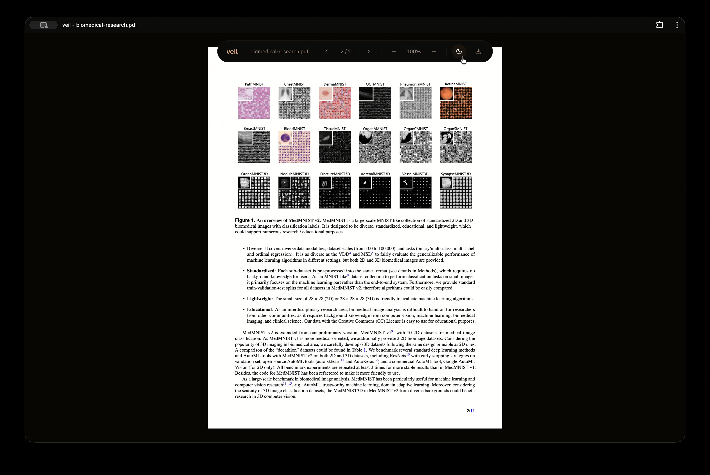

<p align="center">
  <a href="https://veil.simoneamico.com">
    
  </a>
</p>

<br />

<h3 align="center">Open source PDF reader with smart dark mode.<br>Text inverted, images preserved, scanned documents made selectable.</h3>

<br />

<p align="center">
  <br /><br />
  <a href="https://veil.simoneamico.com"><strong>Start reading</strong></a>
</p>

<br />

## Features

- Smart dark mode. Text inverted, images and charts preserved in original colors.
- Per-page override. Force dark or light on any page, respected in export.
- Selectable text layer with clean copy/paste across font styles and weights.
- OCR on images inside native PDFs. Chart labels, axis text, figure captions become selectable. Option/Alt + drag for vertical text (Y-axis labels, rotated annotations).
- Scanned documents detected automatically, full-page OCR runs in the background.
- Already-dark pages (slides, dark themes) detected and left untouched.
- Export to PDF with dark mode baked in, selectable text, and working links.
- Link annotations preserved. External URLs and internal navigation both work.
- Zoom with native re-rendering via PDF.js. Sharp text at any level, not bitmap stretching.
- Installable PWA with offline support. Runs client-side, no server.

## How it works

Veil uses PDF.js to render each page, then applies CSS inversion for the dark background. A second canvas restores the original image pixels over the inverted regions, so photos, charts, and diagrams keep their true colors. Image detection walks the PDF operator list via the public API, no fork required.

Scanned documents are detected by sampling a few pages. Tesseract.js runs OCR in the background, and the recognized text becomes a selectable layer. Language is picked up from your system preferences.

## Development

```
npm install
npm test            # 329 unit tests (~2s)
npm run test:e2e    # 53 browser tests (Playwright)
npm run serve       # http://localhost:8000
```

382 tests (329 unit + 53 e2e) including performance benchmarks.

---

<p align="center">
  <a href="https://veil.simoneamico.com">veil.simoneamico.com</a>
</p>